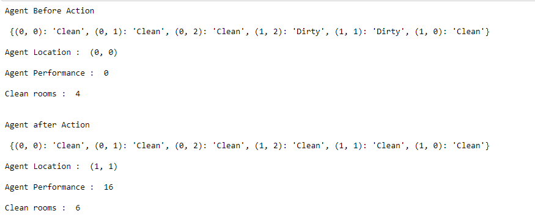

### EX NO : 01
### DATE  : 04.04.2022
# <p align="center"> Developing AI Agent with PEAS Description </p>

## AIM

To find the PEAS description for the given AI problem and develop an AI agent.

## THEORY
A vacuum-cleaner world with 6 locations.
Each location can be clean or dirty.
The agent can move left, right, up, down,and can clean the square that it occupies.

## PEAS DESCRIPTION
| Agent type    | performance  measurement      |environment  |   Actuators         |  sensors                       | 
|-------------  | ---------------------------   | ----------- |-------------------- | ------------------------------ | 
| vaccum cleaner| cleanliness ,number of moments| Rooms       |  wheels,suction tool|  location, cleanliness         |


## DESIGN STEPS
### STEP 1:
The inputs are location of the agent and the status of the location

### STEP 2:
The output of the system is Right Left and Suck.

### STEP 3:
Agent Type:Vaccum Cleaner
Performance Measure: Cleanliness , Number of Movements
Environment: Rooms
Actuators: Wheels and Suction tool
Sensor: Location Sensor and Cleanliness sensor

### STEP 4:
The agent should detect the location and suck if the location it is dirty,else it should move to the next location.

### STEP 5:
The performance is measured with the number of movements and the cleaning action of the agent.

## PROGRAM
```
Developed by:Gowri M
Register No :212220230019
```

```python
import random
import time


def TableDrivenAgentProgram(table):
    percepts = []

    def program(percept):
        percepts.append(percept)
        action=table.get(tuple(percept))
        return action

    return program

loc_A, loc_B, loc_C, loc_D, loc_E, loc_F = (0,0), (0,1), (0,2), (1,2), (1,1), (1,0) 

def TableDrivenVacuumAgent():
    table = {(loc_A, 'Clean'): 'Right1',
             (loc_A, 'Dirty'): 'Suck',
             (loc_B, 'Clean'): 'Right2',
             (loc_B, 'Dirty'): 'Suck',
             (loc_C, 'Clean'): 'Up',
             (loc_C, 'Dirty'): 'Suck',
             (loc_D, 'Clean'): 'Left1',
             (loc_D, 'Dirty'): 'Suck',
             (loc_E, 'Clean'): 'Left2',
             (loc_E, 'Dirty'): 'Suck',
             (loc_F, 'Clean'): 'Down',
             (loc_F, 'Dirty'): 'Suck',
             
             
    }
    return Agent(TableDrivenAgentProgram(table))
#right1,2,3,4 start left1,2 up1,2


class TrivialVacuumEnvironment(Environment):
    def __init__(self):
        super().__init__()
        self.status = {loc_A: random.choice(['Clean', 'Dirty']),
                       loc_B: random.choice(['Clean', 'Dirty']),
                       loc_C: random.choice(['Clean', 'Dirty']),
                       loc_D: random.choice(['Clean', 'Dirty']),
                       loc_E: random.choice(['Clean', 'Dirty']),
                       loc_F: random.choice(['Clean', 'Dirty']),}        

    def thing_classes(self):
        return [ TableDrivenVacuumAgent]

    def percept(self, agent):
        return agent.location, self.status[agent.location]
    def clean_check(self):
        number_of_clean_rooms=0
        for key in [loc_A, loc_B, loc_C, loc_D, loc_E, loc_F]:
            if self.status[key] =='Clean':
                number_of_clean_rooms=number_of_clean_rooms+1
        return number_of_clean_rooms
    def execute_action(self, agent, action
        if (self.clean_check()!=9):
            
            if action=='Right1':
                agent.location = loc_B
                agent.performance -=1
            elif action=='Right2':
                agent.location = loc_C
                agent.performance -=1
            elif action=='Left1':
                agent.location = loc_E
                agent.performance -=1
            elif action=='Left2':
                agent.location = loc_F
                agent.performance -=1
            elif action=='Up':
                agent.location = loc_D
                agent.performance -=1
            elif action=='Start':
                agent.location = loc_A
                agent.performance -=1
            elif action=='Suck':
                if self.status[agent.location]=='Dirty':
                    agent.performance+=10
                self.status[agent.location]='Clean'

    def default_location(self, thing):
        return random.choice([loc_A, loc_B, loc_C, loc_D, loc_E, loc_F])


if __name__ == "__main__":
    agent = TableDrivenVacuumAgent()
    environment = TrivialVacuumEnvironment()
    environment.add_thing(agent)
    print('Agent Before Action\n\n',environment.status)
    print('\nAgent Location : ',agent.location)
    print('\nAgent Performance : ',agent.performance)
    print("\nClean rooms : ",environment.clean_check())

    environment.run(steps=6)
    print('\n\nAgent after Action\n\n',environment.status)
    print('\nAgent Location : ',agent.location)
    print('\nAgent Performance : ',agent.performance)
    print("\nClean rooms : ",environment.clean_check())
        


```


## OUTPUT

</br>

## RESULT

Thus, an AI agent was developed and PEAS description is given.
